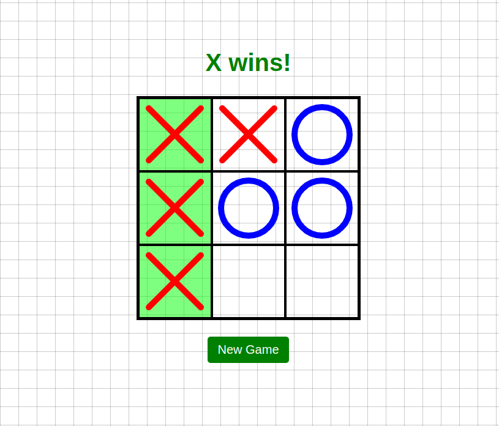

## [Github Pages of the project](https://arseniiadamaksina.github.io/tic-tac-toe/)

# Tic Tac Toe Game: Back End Assignment

Welcome to the Tic Tac Toe game assignment! This project is focused on developing a classic Tic Tac Toe game using vanilla JavaScript. The main goals are to build a functional game and emphasize best coding practices, including the use of plain JavaScript and the separation of concerns.

## Game Overview

### Introduction

Tic Tac Toe is a two-player game where each player takes turns marking a space in a 3x3 grid. The aim is to place three marks in a row, either horizontally, vertically, or diagonally.

### Game Conditions

- 3x3 grid.
- Players use 'X' or 'O' marks.
- Three marks in a line to win.
- A draw if all squares are filled without a win.
- "New game" button restarts the game.

